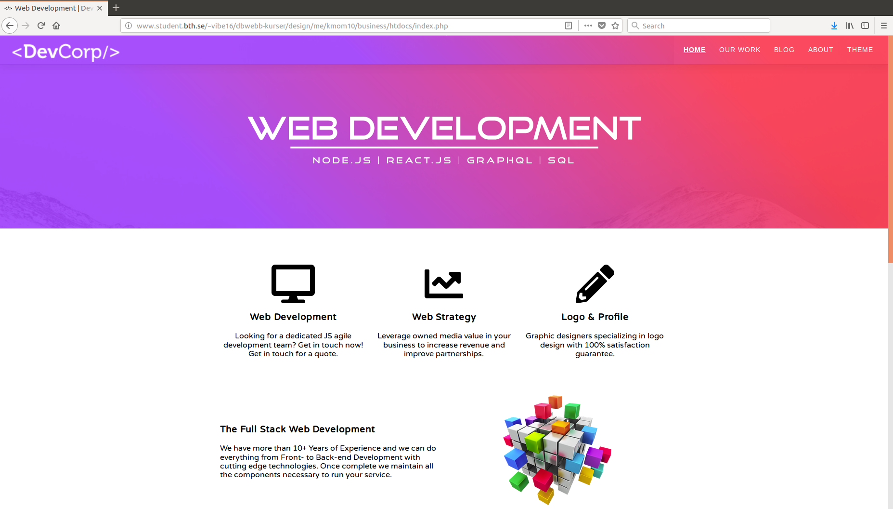

# bth_design_project

## About DevCorp

This website is part of the last assignment in the course [Design](https://dbwebb.se/kurser/design-v1) at Blekinge Institute of Technology. 

The assignment was to design a couple of different website themes to self-employed Bew Gorp, who has started a business where he offer his services as a web developer / web designer.



## Install your own version

```
git clone https://github.com/Zero2k/bth_design_project.git
```

## Install dependencies

```
make update OR composer update
```

## License

This software carries a MIT license.

```
 .  
..:  Copyright (c) 2018 Viktor Bengtsson (vibe16@student.bth.se)
